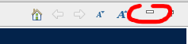
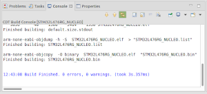
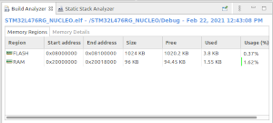
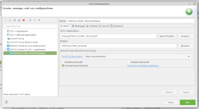
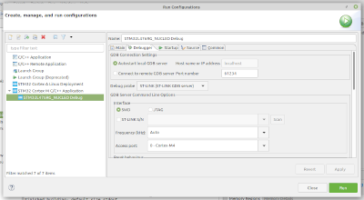
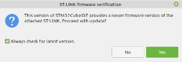
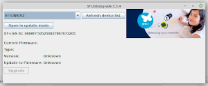
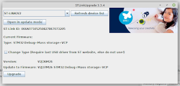

### Table of contents

Click on the  icon above.

# Overview

This short tutorial describes a way to make a virtual machine configured for STM32 software development with STM32CubeIDE, and explains how to use it. The virtualization environment is VirtualBox, and the guest machine runs Linux Mint.

# Prerequisites

* Hardware: a 64-bit computer with enough memory so that the VM can be granted 16 GB, with a few tens of GB available on the disk, and one free USB A port
* Hardware (bis): a [Nucleo-L476RG board](https://www.st.com/content/st_com/en/products/evaluation-tools/product-evaluation-tools/mcu-mpu-eval-tools/stm32-mcu-mpu-eval-tools/stm32-nucleo-boards/nucleo-l476rg.html) with an USB A / micro USB B cable - any similar NUCLEO board can be used
* Developer: 
  * basic knowledge of Linux (knowing the most common commands...)
  * basic knowledge of VirtualBox (knowing how to create a virtual machine...)

# Creation of the VM

Follow the instructions in [this guide](https://github.com/PascalBod/lm-vm).

Be sure to provide the guest machine with enough resources. STM32CubeIDE is quite power-hungry. The guide recommends 16 GB for RAM and two CPUs. On my i7-8559U host machine, a one-CPU VM won't display correctly the Device Configuration Tool (aka CubeMX) window: two CPUs are required.

# VM configuration

## STM32CubeIDE installation

According to the [Installation Guide](https://my.st.com/resource/en/user_manual/dm00603964-stm32cubeide-installation-guide-stmicroelectronics.pdf):
* [Download STM32CubeIDE Debian Linux Installer](https://www.st.com/content/st_com/en/products/development-tools/software-development-tools/stm32-software-development-tools/stm32-ides/stm32cubeide.html), version 1.9.0 at the time of writing. You will have to create an account
* Unzip the file
* Run resulting script:

```shell
$ sudo sh ./st-stm32cubeide_1.9.0_12015_20220302_0855_amd64.deb_bundle.sh
```

* Accept the license, install Segger J-Link udev rules, accept additional licenses

No need to perform the last step, the manual installation, described in the Installation Guide.

# Sample application

## Install sample applications

* Start STM32CubeIDE, from Linux Mint main menu and then **All applications > Programming**
* Keep the default workspace and click the **Launch** button
* Install the STM32 MCU Package for STM32L4 Series (version 1.17.2 at the time of writing):
  * Select **Help > Manage Embedded Software Packages**
  * On the **STM32Cube MCU Packages** tab, expand the **STM32L4** list and select the package
  * Click the **Install** button

The package is installed in `/home/developer/STM32Cube/Repository/STM32Cube_FW_L4_V1.17.2`.

## Import a sample application

* Click on the *Minimize* icon of the *Information Center* window, in the upper right-hand corner:



* Select **File > Import...**
* Select **General > Import ac6 System Workbench for STM32Project**
* Click the **Next >** button
* For **Import source**, select `/home/developer/STM32Cube/Repository/STM32Cube_FW_L4_V1.17.2/Projects/NUCLEO-L476RG/Examples/GPIO/GPIO_EXTI/SW4STM32/STM32L476RG_NUCLEO`
* Click the **Finish** button
* Accept project conversion
* A project named *STM32L476RG_NUCLEO* appears in the *Project Explorer* window
* Click the small vertical triangle at the left of the project name, in order to display project files
* Select **Project > Build Project**. If nothing happens, right-click on the project and select **Build Project**

At the end of the build, the **Console** window displays the result:

<a href="images/console.png"></a>

The **Build Analyzer** window provides memory usage information:

<a href="images/buildAnalyzer.png"></a>

## Flash and run the application

Connect the NUCLEO board to the host PC. Check that the virtual machine can see it, with **Devices > USB** from VirtualBox menu. A new USB device should be visible: *STMicroelectronics STM32 STLink [0100]*. Tick the associated checkbox.

Assign the board to the virtual machine on a permanent basis:
* Select **Device > USB > USB Settings...**
* Click on the *Add new USB filter* button
* Select the board
* Click the **OK** button

In the Project Explorer window, open the `Debug` directory and select `STM32L476RG_NUCLEO.bin`. This is the binary file to use to program the board.

Create a run configuration by selecting **Run > Run configurations...**. Select **STM32 Cortex-M C/C++ Application**. 
Click on the *New Launch Configuration* tool, above the list of configuration types. The various fields should be prefilled with the right default values:

<a href="images/runConfigurationsMain.png"></a>
<a href="images/runConfigurationsDebugger.png"></a>

Click the **Run** button.

Depending on the version of the NUCLEO board, a window requesting an update of the ST-Link firmware may be displayed:

<a href="images/stLinkFirmwareVerification.png"></a>

Click the **Yes** button.

The ST-Link upgrade window is displayed:

<a href="images/stLinkUpgrade.png"></a>

Click the **Open in update mode** button. The window displays firmware version information:

<a href="images/stLinkUpgradeUpdate.png"></a>

Click the **Upgrade** button. At the end of the upgrade, close the window.

Request again to run the above run configuration. The Console window displays a rebuild, the board programming, and ends with a message saying that the debugger connection is lost. That's normal, as we didn't start a debugging session.

Push the board blue button. The green LED should light up when you release the button. Push again, it should cut out when the button is released.

## Reference documents

* [STM32CubeIDE documentation](https://www.st.com/content/st_com/en/products/development-tools/software-development-tools/stm32-software-development-tools/stm32-ides/stm32cubeide.html#documentation)
* [STM32CubeL4 documentation](https://www.st.com/content/st_com/en/products/embedded-software/mcu-mpu-embedded-software/stm32-embedded-software/stm32cube-mcu-mpu-packages/stm32cubel4.html#documentation)
* [STM32CubeIDE basics MOOC](https://www.st.com/content/st_com/en/support/learning/stm32-education/stm32-moocs/STM32CubeIDE_basics_MOOC.html)

# Update

STM32CubeIDE is installed with sudo. This means that the file owner is `root`. Consequently, updating STM32CubeIDE using Eclipse update mechanism (**Help > Check for Updates**) fails, when you run STM32CubeIDE from a normal user.

One way to use this update mechanism would be to start STM32CubeIDE from `root`. But trying this, I got in trouble: STM32CubeIDE refused to start after an update from 1.7.0 to 1.8.0. Consequently, now, instead of updating, I install the new version from scratch. An additional benefit: the previous version can be kept.